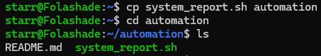
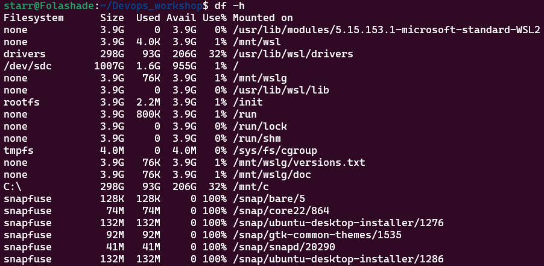
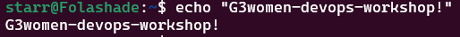
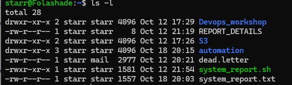
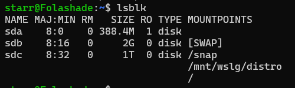
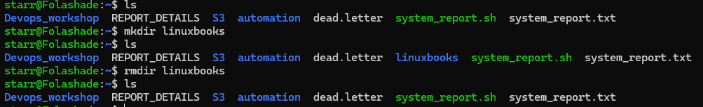

**Exploring Basic Linux Commands: A Practical Guide**

```markdown
# Linux Commands Documentation

This document contains various Linux commands I experimented with during the workshop. Each command includes a brief description, how to use it, an example, and a screenshot of the output.

## 1. `cd`
**Description:** The `cd` command changes the current directory to the specified path.  
**Usage:** 
```bash
cd <directory_path>
```
**Example:**
```bash
cd /home/user
```
**Output:**  


---

## 2. `touch`
**Description:** The `touch` command creates a new file or updates the timestamp of an existing file.  
**Usage:** 
```bash
touch <filename>
```
**Example:**
```bash
touch example.txt
```
**Output:**  


---

## 3. `cp`
**Description:** The `cp` command copies files and directories.  
**Usage:** 
```bash
cp <source> <destination>
```
**Example:**
```bash
cp file1.txt file2.txt
```
**Output:**  


---

## 4. `df -h`
**Description:** The `df -h` command displays disk space usage in a human-readable format.  
**Usage:** 
```bash
df -h
```
**Output:**  


---

## 5. `echo`
**Description:** The `echo` command displays a line of text or a variable value in the terminal.  
**Usage:** 
```bash
echo <string>
```
**Example:**
```bash
echo "Hello, World!"
```
**Output:**  


---

## 6. `ls`
**Description:** The ls command lists the contents of a directory

**Usage:** 
```bash
ls
```
**Output:**  


## 7. `ls -l`
**Description:** The `ls -l` command lists directory contents in a long format, showing details like permissions, owner, and file size.  
**Usage:** 
```bash
ls -l
```
**Output:**  


---

## 8. `lsblk`
**Description:** The `lsblk` command lists all block devices (like hard drives and partitions) in a tree-like format.  
**Usage:** 
```bash
lsblk
```
**Output:**  


---

## 9. `mkdir`
**Description:** The `mkdir` command creates a new directory.  
**Usage:** 
```bash
mkdir <directory_name>
```
**Example:**
```bash
mkdir new_folder
```
**Output:**  


---

## 10. `rmdir`
**Description:** The `rmdir` command removes an empty directory.  
**Usage:** 
```bash
rmdir <directory_name>
```
**Example:**
```bash
rmdir empty_folder
```
**Output:**  

```
